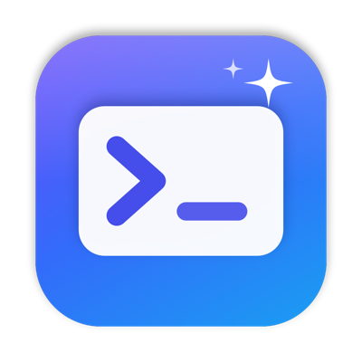

<p align="center">
  
</p>

<h1 align="center">Prompty</h1>

<p align="center">
  <b>Your best prompts, one shortcut away.</b><br>
  A tiny, fast macOS menu-bar app for saving and reusing AI prompts.
</p>

---

You keep rewriting the same prompts for ChatGPT, Claude and friends. Prompty keeps them in one place: press **⌃⌥Space** from any app, find a prompt and copy it. You never leave what you're doing.

## Why Prompty

- **⚡ Instant.** Opens like Spotlight from any app and closes when you're done.
- **🧩 Templates.** Write `{{name}}` in a prompt and Prompty asks you to fill it in before copying. Add defaults with `{{tone:friendly}}`.
- **📋 Clipboard-aware.** `{{clipboard}}` drops in whatever you last copied. Great for "summarize this" or "review this code".
- **⭐ Favorites.** Pin your top prompts and reach them with ⌘1–⌘9.
- **🔎 Search.** Type a few letters to find any prompt by its name or text.
- **🪟 Move it anywhere.** Drag the window wherever you like. Drag it back near the centre and it snaps home.
- **🔒 Private.** No account, no cloud, no tracking. Your prompts live in one file on your Mac.

## Install

1. Download `Prompty.zip` from [Releases](https://github.com/Ephab/Prompty/releases/latest) and unzip it.
2. Move **Prompty.app** to your Applications folder.
3. The first time, **right-click → Open** (the app isn't notarized yet).
4. Look for the Prompty icon in your menu bar, or press **⌃⌥Space**.

Requires **macOS 26** or newer.

## Using it

| Shortcut | What it does |
| --- | --- |
| `⌃⌥Space` | Open Prompty from any app (change it in Settings) |
| `↵` | Copy the prompt, or fill in a template first |
| `⌘1`–`⌘9` | Copy a result by number (hold ⌘ to see the numbers) |
| `⌘N` | New prompt |
| `⌘K` | All actions for the selected prompt |
| `Esc` | Clear the search, then close |

### Template example

```
Review this {{language}} code for {{focus:security and readability}}:

{{clipboard}}
```

Copy some code, open Prompty and press ↵. Fill in *language*, keep or change *focus*, and the finished prompt is on your clipboard.

## Build from source

You need Swift 6.3+ (the Xcode Command Line Tools are enough).

```sh
./Scripts/package.sh      # builds dist/Prompty.app and dist/Prompty.zip
./Scripts/check.sh        # runs the checks
open dist/Prompty.app
```

To regenerate the app icon, run `./Scripts/make-icon.sh`.

Your prompts are stored in `~/Library/Application Support/Prompty/prompts.json`.
